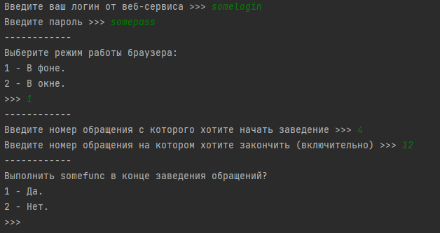
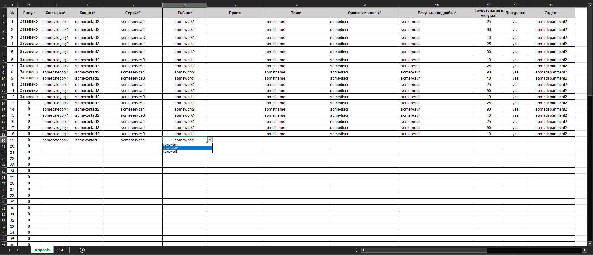
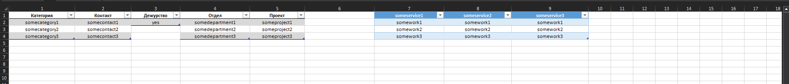

# auto_appeals
Инструмент автоматизации заполнения определенных форм на определенном веб-сервисе с помощью Selenium (обезличен).
A tool to automate filling out certain forms on a specific web service using Selenium (depersonalized).

Проект представляет собой инструмент автоматизации заполнения определенных форм на определенном веб-сервисе
для личного использования. Данная версия проекта является обезличеной.
____________________________________________________________
Структура:
- auto_filling.py 	- скрипт для автоматизации заполнения форм.
- funcs.py 		- модуль с функциями, классом и методами, которые использует auto_filling.py
- links.py 		- модуль со ссылками в словаре на веб страницу и веб элементы
- done_delete.py 	- скрипт для очищения статусов задач в DoneDelete.xlsx
- Appeals.xlsx 	- таблица для заготовок задач для последующего заведения в формы.
- DoneDelete.xlsx 	- таблица статусов обращений
____________________________________________________________
Инструкция:
1) Готовим шаблоны под себя в таблице "Appeals.xlsx", заносим нужные данные в контекстные списки со страницы Lists.
2) Заполняем страницу Tasks таблицы "Appeals.xlsx", используя подготовленные шаблоны.
3) Запускаем "auto_appeals.py", устанавливаем параметры заполнения форм, запускаем заполнение форм с выставленными параметрами.
4) В таблице перед каждой задачей в каждой строке устанавливается статус заполнения "Заведено". Чтобы очистить статусы запускаем "DoneDelete.py"
____________________________________________________________
Screenshots:
 

</img>

</img>

</img>
