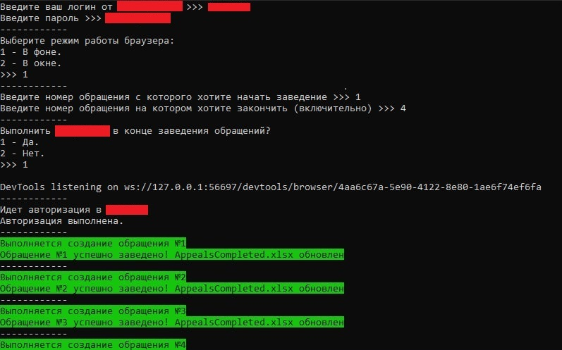

# auto_appeals

A tool to automate filling out certain forms on a specific web service using Selenium (depersonalized).

Проект представляет собой инструмент автоматизации заполнения определенных форм на определенном веб-сервисе
для личного использования. Данная версия проекта является обезличеной.

Структура:

<table border="1">
    <thead>
        <tr>
            <th>Название файла</th>
            <th>Описание</th>
        </tr>
    </thead>
    <tbody>
        <tr>
            <td>auto_appeals.py</td>
            <td>скрипт для автоматизации заполнения форм.</td>
        </tr>
        <tr>
            <td>funcs.py</td>
            <td>модуль с функциями, классом и методами, которые использует auto_appeals.py</td>
        </tr>
        <tr>
            <td>links.py</td>
            <td>модуль со ссылками в словаре на веб страницу и веб элементы</td>
        </tr>
        <tr>
            <td>done_delete.py</td>
            <td>скрипт для очищения статусов задач в DoneDelete.xlsx</td>
        </tr>
        <tr>
            <td>Appeals.xlsx</td>
            <td>таблица для заготовок задач для последующего заведения в формы.</td>
        </tr>
        <tr>
            <td>DoneDelete.xlsx</td>
            <td>таблица статусов обращений</td>
        </tr>
    </tbody>
</table>

Инструкция:

1) Готовим шаблоны под себя в таблице "Appeals.xlsx", заносим нужные данные в контекстные списки на странице "Lists".

2) Заполняем страницу "Tasks" таблицы "Appeals.xlsx", используя подготовленные шаблоны.

3) Запускаем "auto_appeals.py", устанавливаем параметры заполнения форм, выполняем.

4) В таблице перед каждой задачей в каждой строке устанавливается статус заполнения "Заведено". Чтобы очистить статусы запускаем "DoneDelete.py"

Screenshots:

</img>

</img>

</img>
